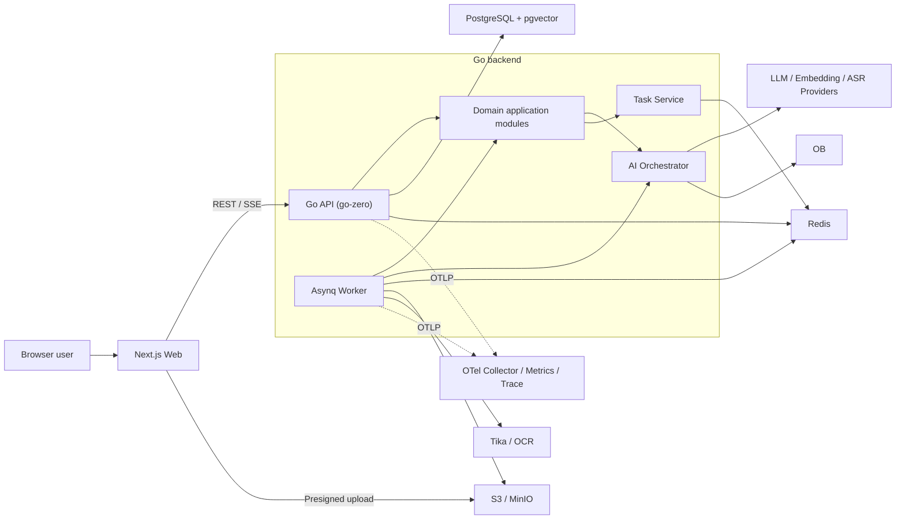
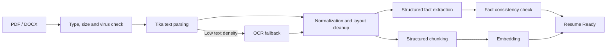

# InterviewMaster Technical Plan v1.0 (Formal Baseline)

> Updated: 2026-07-18
> Current status: **Archived, for historical reference only; it is not the current technical or product baseline**. The current product flow is described in [`../launch-redesign_0814.md`](../launch-redesign_0814.md); the documentation directory is [`../README.md`](../README.md); the invite-only execution checklist is [`../invite-beta-todo_0828.md`](../invite-beta-todo_0828.md).
> Applicable stage: MVP → Beta; the formal-scale stage only reserves evolution paths and does not introduce complexity early

## 1. Plan conclusion

InterviewMaster is positioned as an AI interview-training product for job seekers, forming the following complete loop:

1. Upload and analyze a resume;
2. Bind a target role, JD and target company;
3. Generate personalized prediction questions with evidence;
4. Conduct a text-based mock interview;
5. Output per-question scores, improvement suggestions, reference answers and a training plan;
6. Add interview-content intelligence, speech-to-text and voice simulation during Beta.

The project's technical baseline is:

| Decision | Selected solution | Conclusion |
| --- | --- | --- |
| Code repository | Frontend/backend monorepo | Unify contracts, versions and CI |
| Initial architecture | Modular monolithic API + independent asynchronous Worker | Do not split into seven microservices during MVP |
| Backend | Go 1.26.x + go-zero REST | Preserve the option to split to zRPC later |
| Frontend | Next.js App Router + React + TypeScript | Web first; support desktop and mobile browsers |
| Primary database | PostgreSQL 18.x + pgvector | Manage business data, JSON, full-text indexes and MVP vector retrieval in one system |
| Data access | pgx/v5 + sqlc + Goose | PostgreSQL-native capabilities, type-safe queries and versioned migrations |
| Cache/queue | Redis + Asynq | Cache, rate limiting, asynchronous parsing and report generation |
| File storage | S3-compatible object storage; MinIO locally | Keep resumes, audio and exported reports out of large database fields |
| Document parsing | Go orchestration + Apache Tika parser adapter + OCR fallback | Isolate parsing behind interfaces so it can be replaced by a cloud service |
| AI orchestration | Native Go application services + self-defined Provider interfaces | Do not bind the business core to one model or LangChainGo |
| Real-time interaction | REST + SSE; introduce WebSocket during the voice phase | Simplify MVP while supporting streaming output and task progress |
| API contract | go-zero `.api` as the single source of truth, generating Swagger/OpenAPI and frontend types | Avoid frontend/backend type drift |
| Deployment | Start with Docker Compose; production has Web/API/Worker container types | Use Kubernetes only after scale reaches the split threshold |

### 1.1 Key adjustments to the existing plan

- Converge the seven-service design of `gateway/user/resume/interview/search/rag/ingestion` into one API process and one Worker process. Retain module boundaries, but do not pay the cost of RPC, service discovery, distributed transactions and multi-repository integration at the beginning.
- Add “AI text mock interviews.” The original plan had only prediction questions and real-interview review, and did not yet form a continuous training loop for users.
- LangChainGo is no longer part of the core architecture. It may be used in a Provider or experimental feature, but Prompts, model calls, retrieval, structured output and auditing are controlled by the project's own interfaces.
- Fix and version vector models and dimensions by “Embedding Space”; do not casually mix different dimensions in one vector index.
- Replace “all generation completes in 5–10 seconds” with layered latency targets: define separate metrics for ordinary APIs, streaming first packet, short generation and deep reports.
- Complete the frontend architecture, AI evaluation, Prompt Injection protection, model cost governance, external interview-content compliance and user-data deletion capability.

### 1.2 Database-selection conclusion

After confirming that OceanBase is not a hard project requirement, the data layer is set to **PostgreSQL 18.x + pgvector**. The MVP does not deploy a dedicated vector database.

| Option | Advantages | Cost | Conclusion |
| --- | --- | --- | --- |
| PostgreSQL + pgvector | Unified transactions, JSON, full text, vectors and backup system; mature Go ecosystem; simple local and cloud environments | Hybrid retrieval for very large public corpora is weaker than a dedicated engine | Adopt for MVP |
| PostgreSQL + Qdrant | Stronger Dense/Sparse hybrid retrieval, RRF, filtering and horizontal scaling | Higher cost for dual storage, synchronization, backups and permission consistency | Introduce only after Beta reaches the split threshold |
| OceanBase | High integration of distributed relational storage and hybrid retrieval | The current product does not need its main advantages; local resource and engineering complexity are higher | Do not adopt |
| PostgreSQL + OpenSearch | Strong full-text retrieval and aggregation | Heaviest operations burden; dual-write consistency remains necessary | Do not adopt for now |

Specific strategy:

- Private resumes/JDs/interview content usually contain only hundreds to thousands of Chunks. Prefer exact pgvector retrieval filtered by `workspace_id` to obtain stable full recall;
- When volume grows, enable HNSW and iterative scanning for public content, and continuously compare Recall against exact retrieval;
- Combine structured `keywords`, GIN/`pg_trgm` and vector retrieval for Chinese technical terms and proper nouns; do not depend on PostgreSQL's English stemming capability;
- When the Beta public interview corpus reaches approximately 1 million Chunks, vector-index memory/latency becomes unacceptable, or hybrid-retrieval evaluations remain below target, migrate the public Knowledge index to Qdrant;
- PostgreSQL remains the source of truth for document metadata, permissions and task state. Even after Qdrant is introduced, it is only a rebuildable retrieval index.

## 2. Product boundaries and stage scope

### 2.1 Target users

The MVP primarily serves individual job seekers. The data model uses `workspace_id` as the unified isolation boundary: each individual user automatically owns a personal workspace, which can naturally expand to schools, training institutions or enterprise teams without duplicating `tenant_id + user_id` in every table.

System roles:

- Job seeker: manage resumes, target roles, question banks, mock interviews and review reports;
- Operations administrator: manage content sources, Prompt/model configuration, failed tasks and usage anomalies; the MVP provides only minimal management APIs, not a full operations console.

### 2.2 MVP must deliver

- Email or username registration, login, token refresh and logout;
- PDF/DOCX resume upload, parsing, version management and status queries;
- Resume-fact extraction: skills, experience, projects, responsibilities, metrics and risk points;
- Target-role/JD creation and capability-requirement extraction;
- Personalized prediction questions: question, difficulty, assessment points, answer points, follow-up branches and resume evidence;
- Text mock interviews: ask questions according to an interview plan and decide follow-ups based on the previous answer;
- Interview reports: per-question scores, evidence, issues, improvement suggestions, reference answers and training checklist;
- Dashboard: task status, recent training, weak areas and model-quota overview;
- User-data export and deletion entry points.

### 2.3 Beta scope

- Company/role interview-content retrieval, deduplication, clustering and freshness decay;
- Audio upload, ASR transcription, speaker diarization and Q&A segmentation;
- Voice mock interviews;
- Training plans, incorrect-question review and capability trends;
- More complete operations management, model routing and paid quotas.

### 2.4 Explicitly out of scope

- Do not provide covert real-time answering or cheating assistance during real interviews;
- MVP does not include video interviews, facial-expression recognition or so-called “emotion lie detection”;
- MVP does not include recruiting-side ATS, job posting or candidate-screening systems;
- MVP does not train a proprietary large model; first validate product value through model APIs + RAG;
- MVP does not split services merely to achieve “microservice completeness.”

## 3. Overall architecture



### 3.1 Deployment units

The MVP has only three application deployment units:

1. `web`: Next.js pages and static assets;
2. `api`: authentication, synchronous business APIs, SSE and task enqueueing;
3. `worker`: time-consuming tasks such as resume parsing, Embedding, question generation and interview reports.

API and Worker share domain modules and repository interfaces, but use different entry points and resource quotas. The Worker can scale horizontally by queue.

### 3.2 Three request modes

| Mode | Use cases | Return method |
| --- | --- | --- |
| Synchronous REST | Login, CRUD, lists and reading completed reports | Return the result directly |
| Asynchronous task | Resume parsing, batch Embedding, deep reports and interview-content ingestion | `202 + task_id`, with SSE/query progress |
| Streaming generation | Mock-interview questions and short-answer improvement | SSE token/events |

Bidirectional real-time audio streams use WebSocket in Beta; WebSocket is not the default transport for ordinary business operations.

Task-progress events use bounded-retention Redis Streams instead of unrecoverable pure Pub/Sub. When SSE disconnects, `Last-Event-ID` can read events from the retained window; outside that window, fall back to the final state in the `tasks` table.

## 4. Backend architecture

### 4.1 Code structure

```text
InterviewMaster/
├── backend/
│   ├── api/                         # go-zero .api contract
│   ├── cmd/
│   │   ├── api/                     # HTTP/SSE entry point
│   │   └── worker/                  # Asynq Worker entry point
│   ├── internal/
│   │   ├── modules/
│   │   │   ├── identity/            # users, sessions, workspaces
│   │   │   ├── resume/              # resumes and structured facts
│   │   │   ├── job/                 # target roles and JDs
│   │   │   ├── question/            # prediction question sets
│   │   │   ├── interview/           # mock interview and round state machine
│   │   │   ├── evaluation/          # scoring, reports and training plans
│   │   │   ├── knowledge/           # documents, chunks, retrieval and interview content
│   │   │   └── task/                # asynchronous task state
│   │   └── platform/
│   │       ├── ai/                  # model Providers and call governance
│   │       ├── db/                  # pgx, transactions, sqlc queries and repositories
│   │       ├── queue/               # Asynq adapter
│   │       ├── objectstore/         # S3/MinIO adapter
│   │       ├── parser/              # Tika/OCR adapter
│   │       ├── auth/                 # JWT, refresh tokens and permissions
│   │       └── telemetry/            # logs, metrics and traces
│   ├── migrations/
│   ├── prompts/                     # Prompt templates and version metadata
│   └── tests/
├── web/
├── deploy/
├── docs/
└── Makefile
```

Generated Handlers/Types are responsible only for protocol conversion and validation; business rules belong in module application services. Databases, models and queues are all injected through interfaces. When services are split later, complete modules move instead of extracting business logic from Handlers again.

### 4.2 Domain-module responsibilities

| Module | Core responsibility | Does not handle |
| --- | --- | --- |
| Identity | Authentication sessions, workspaces, permissions and usage identity | Interview business |
| Resume | File versions, parsing state and resume facts | Calling the frontend or assembling Prompts directly |
| Job | Target companies, roles, JDs and capability tags | Interview-content crawling |
| Question | Question-set generation, question versions and evidence associations | Mock-session state |
| Interview | Interview plan, rounds, follow-ups and state machine | Scoring-rule configuration |
| Evaluation | Rubrics, per-question evaluation, reports and training plans | Modifying original answers |
| Knowledge | Documents, chunks, Embeddings, hybrid retrieval and sources | Final business decisions |
| Task | Task state, progress, retry results and idempotency | Replacing the Asynq message itself |

### 4.3 State machines

Resume:

```text
UPLOADED → PARSING → EXTRACTING → EMBEDDING → READY
              └──────── Any-stage failure ────────→ FAILED
```

Mock interview:

```text
DRAFT → READY → IN_PROGRESS → COMPLETED → EVALUATING → REPORTED
                     └→ ABORTED                 └→ FAILED
```

Validate state transitions in application services and use conditional database updates to prevent duplicate requests from causing jumps over states.

### 4.4 Asynchronous-task constraints

Asynq provides at-least-once execution semantics, so every Handler must be idempotent:

- The business database `tasks` table is the source of truth for user-visible state; the Redis queue is not;
- Tasks use `task_type + resource_id + resource_version` as the idempotency key;
- External model calls are written to `model_invocations`, where request hashes can identify duplicate calls;
- Database result writes use unique constraints or compare-and-set;
- Retries use exponential backoff; parameter/file-corruption errors go directly to a non-retryable failure;
- Queues are recommended to be `interactive`, `default` and `heavy`, with separate concurrency and model-quota limits;
- Asynq is still v0.x; pin the exact version and wrap it behind a `Queue` interface.

## 5. Frontend architecture

### 5.1 Technology stack

- Next.js App Router, React and TypeScript;
- Tailwind CSS + shadcn/ui, forming the project's own Design Token;
- TanStack Query for server state, caching, retries and invalidation;
- React Hook Form + Zod for forms and frontend validation;
- Zustand only for temporary UI state in the mock-interview room; do not duplicate server business data;
- Generate API types and request clients through `.api → Swagger/OpenAPI → TypeScript Client`;
- Vitest/React Testing Library for component tests and Playwright for critical-flow E2E.

### 5.2 Pages and routes

```text
/(public)
  /login
  /register
/(workspace)
  /dashboard
  /resumes
  /resumes/[resumeId]
  /jobs
  /jobs/[jobId]
  /question-sets/[setId]
  /interviews/new
  /interviews/[sessionId]/room
  /interviews/[sessionId]/report
  /company-intel                 # Beta
  /settings
```

### 5.3 Frontend layering

```text
web/src/
├── app/                 # routes, layouts, loading/error boundaries
├── features/            # resume/job/interview/report business components
├── entities/            # stable domain types and display components
├── shared/
│   ├── api/             # generated Client + small wrappers
│   ├── ui/              # shared UI
│   ├── hooks/
│   └── lib/
└── styles/
```

Constraints:

- Prefer fetching initial page data in Server Components; use Client Components for file uploads, SSE and the interview room;
- Receive task-progress events through one SSE connection, resuming with `Last-Event-ID` after a disconnect;
- Report charts display server-side structured results; do not recalculate scores in the browser;
- Prefer presigned object-storage URLs for file uploads, then call the API to create the file record;
- Every key page must have Loading, Empty, Error, Retry and task-processing states.

## 6. AI and RAG architecture

### 6.1 Model abstraction

The core business depends only on the following project interfaces:

```go
type ChatModel interface {
    Generate(ctx context.Context, req GenerateRequest) (GenerateResponse, error)
    Stream(ctx context.Context, req GenerateRequest) (EventStream, error)
}

type EmbeddingModel interface {
    Embed(ctx context.Context, texts []string) ([][]float32, error)
}

type SpeechToTextModel interface {
    Transcribe(ctx context.Context, input AudioInput) (Transcript, error)
}

type Reranker interface {
    Rerank(ctx context.Context, query string, docs []Document) ([]ScoredDocument, error)
}
```

Provider adapters may connect to OpenAI-compatible interfaces, domestic model platforms or local models. The business layer selects capabilities such as an “extraction model, generation model, evaluation model, Embedding or ASR” without exposing Provider SDK types in domain code.

LangChainGo may be used for experimental Loaders, Splitters or Providers, but must not be exposed to domain modules. The project actually needs a small number of testable workflows, strongly typed output and complete auditing, not an irreplaceable Chain layer.

### 6.2 Unified model-call governance

Record for every model call:

- `provider/model/model_revision`;
- `prompt_key/prompt_version`;
- Content hashes and redacted summaries of input and output;
- Tokens, cost, time to first token, total latency and retry count;
- `workspace_id/user_id/task_id/trace_id`;
- Structured-output validation result and cited evidence IDs.

Model output must first enter a Go Struct and pass JSON Schema/business validation. On validation failure, allow only one “repair output” retry; if it still fails, return an explicit failure rather than storing incomplete JSON as a successful result.

### 6.3 Resume-ingestion flow



Do not split into chunks using only a fixed length:

- Divide resumes into basic information, skills, work experience, projects and education;
- Copy parent metadata such as project name, date and role into child chunks;
- Save the original `source_span/page_no` for report citation and location;
- Mark tables or scans with parsing confidence; low-confidence facts cannot be used as certain facts for generation.

### 6.4 Prediction-question generation flow

1. Generate an interview blueprint from resume facts, JD capabilities and the user's choices;
2. Retrieve relevant evidence from the private resume space;
3. During Beta, retrieve interview style from the public company-interview-content space;
4. Generate questions, difficulty, assessment points, answer points and a follow-up tree;
5. Verify the project facts cited by each question;
6. Deduplicate and check difficulty and capability coverage;
7. Save an immutable question-set version.

### 6.5 Mock-interview flow

- Before starting, generate an `InterviewBlueprint`: total rounds, capability distribution, difficulty curve and time budget;
- Each round reads the blueprint, asked questions and the previous answer, then chooses “follow up” or “move to the next capability”;
- During the interview, show only natural interviewer responses and do not reveal the complete score in advance;
- Persist each question and answer immediately so the session can recover after disconnection;
- When the round/time limit is reached or the user ends the interview, freeze the Transcript and enqueue an evaluation task;
- Pin critical Prompt and model versions for the same session to avoid an experience change caused by a model switch midway.

### 6.6 Evaluation and report flow

Do not complete scoring in one Prompt; split it into:

1. `Intent`: question intent and scoring Rubric;
2. `Evidence`: retrieve resume/JD/knowledge evidence;
3. `Evaluation`: five-dimensional scores for technical accuracy, relevance, structure, depth and expression;
4. `Critique`: identify gaps and unverifiable content;
5. `Golden Answer`: generate a reference answer using only verifiable facts;
6. `Aggregation`: aggregate strengths, weaknesses and the training plan.

Technical accuracy cannot rely on self-evaluation by the same generation model alone. The MVP uses “rule checks + an independent Judge call + citation coverage”; later add human-labeled evaluation sets and domain question-bank benchmarks.

### 6.7 Retrieval strategy

Recommended retrieval flow:

```text
Permission/metadata filtering
  → Semantic vector Top 30 + full-text Top 30
  → RRF fusion
  → Optional Reranker Top 8
  → Diversity and Token Budget selection Top 4–6
  → Enter generation context with evidence_id
```

Key filter fields such as `workspace_id/doc_type/company_norm/role_norm/published_at` use dedicated columns and indexes, rather than existing only in JSON. Private and public content use an explicit `visibility` field, and every retrieval must apply the isolation condition at the SQL layer.

### 6.8 Hallucination and Prompt Injection defense

- Retrieved web pages, resumes and Transcripts are all untrusted data, not system instructions;
- Prompts explicitly separate system rules, tasks, evidence and user input;
- Clean HTML, hidden text, scripts and common injection phrases while retaining source audit data;
- The model cannot directly execute database, network or system tools; all actions are performed by backend allowlisted code;
- Fact-based output must carry `evidence_ids`; when evidence is insufficient, return `insufficient_evidence`;
- Reference answers must not invent company scale, QPS, amounts or team size absent from the resume;
- The server validates that citation IDs belong to the current workspace and task context.

## 7. Data architecture

### 7.1 Storage responsibilities

| Data | Storage |
| --- | --- |
| Users, workspaces, resume metadata, interviews, reports and tasks | PostgreSQL relational tables |
| Document chunks, keyword/full-text indexes and vectors | PostgreSQL + pgvector |
| Original resume files, audio and exported files | S3/MinIO |
| Queues, short-lived cache, rate-limit counters and temporary SSE events | Redis |
| Logs, metrics and Traces | OpenTelemetry backend |

### 7.2 Core tables

| Domain | Core tables | Description |
| --- | --- | --- |
| Identity | `users`, `workspaces`, `workspace_members`, `auth_sessions` | Store only refresh-token hashes |
| Resume | `resumes`, `resume_versions`, `resume_facts` | Separate original-file versions from extracted facts |
| Job | `job_targets`, `job_requirements` | Company, role, JD and capability weights |
| Knowledge | `documents`, `document_chunks`, `embedding_spaces`, `chunk_embeddings` | Sources, chunks, vectors and evidence locations |
| Question bank | `question_sets`, `questions`, `question_evidences` | Question-set versions are immutable after publication |
| Interview | `interview_sessions`, `interview_turns`, `interview_events` | Session recovery and state auditing |
| Report | `evaluation_reports`, `evaluation_items`, `training_actions` | Structured data + rendering snapshot |
| System | `tasks`, `model_invocations`, `usage_ledgers` | Tasks, model calls and quotas |
| Interview content | `external_sources`, `company_documents`, `topic_clusters` | Enabled in Beta; retain source and time |

Every main user-data table has `workspace_id`. `created_by` records only the operator and is not the primary isolation condition.

### 7.3 Vector-model version strategy

- One `embedding_space` fixes the Provider, model, dimension, distance algorithm and Chunk strategy;
- One vector index serves only compatible dimensions; never write different dimensions into the same index;
- When upgrading the model, create a new Space, recompute in the background and atomically switch the Active Space;
- Retain the old Space for a short rollback window before deleting it;
- Separate `document_chunks` and `chunk_embeddings`; recomputing vectors must not duplicate text.

By default, exact nearest-neighbor queries in pgvector provide full recall and suit small MVP private knowledge spaces. Create an HNSW approximate index for public corpora only after they reach scale; enable iterative scan for workspace/company-filtered HNSW queries and continuously measure Recall@K with offline exact queries. Do not assume an approximate index is effective merely because queries are faster.

Keyword retrieval uses two layers: write entities such as technology stacks, companies, roles and project names into a normalized `keywords` array with a GIN index; use PostgreSQL `tsvector`/GIN for long English text. Do not force English tokenization onto Chinese text. The MVP relies on entity keywords, `pg_trgm` and vector retrieval; Beta decides whether to use Qdrant Sparse Vector based on evaluation.

### 7.4 Data consistency

- Use a local transaction + Outbox/compensation scan for business records and task enqueueing, avoiding “database succeeded but task was not queued”;
- All create APIs support `Idempotency-Key`;
- Bind reports to immutable `resume_version_id/job_version/model/prompt`;
- Externally display only `READY/REPORTED` versions; save generating drafts separately;
- When deleting user data, first revoke access, then asynchronously delete objects, chunks, vectors and model-call bodies; retain only the minimum non-PII financial/security audit records.

## 8. API design

Use the `/api/v1` prefix consistently, and include at least `code`, `message`, `request_id` and `details` in the unified error format. Use cursor pagination for lists.

### 8.1 Core APIs

```text
POST   /auth/register
POST   /auth/login
POST   /auth/refresh
POST   /auth/logout

POST   /uploads/presign

POST   /resumes
GET    /resumes
GET    /resumes/{resume_id}
POST   /resumes/{resume_id}/versions
POST   /resumes/{resume_id}/analyze

POST   /jobs
GET    /jobs/{job_id}
POST   /jobs/{job_id}/analyze

POST   /question-sets
GET    /question-sets/{set_id}

POST   /interviews
GET    /interviews/{session_id}
POST   /interviews/{session_id}/start
POST   /interviews/{session_id}/turns
POST   /interviews/{session_id}/finish
GET    /interviews/{session_id}/report

GET    /tasks/{task_id}
GET    /events                         # SSE
```

### 8.2 Event format

SSE events only notify state changes and are not the final data store:

```json
{
  "event_id": "evt_...",
  "type": "task.progress",
  "resource_type": "resume",
  "resource_id": "res_...",
  "task_id": "task_...",
  "progress": 60,
  "occurred_at": "2026-07-18T10:00:00Z"
}
```

After receiving a completion event, the frontend rereads the corresponding resource to prevent lost SSE events from making page data inconsistent.

## 9. Security, privacy and content compliance

- Use TLS end to end; use Argon2id for passwords; access tokens are short-lived, refresh tokens rotate and are stored as hashes; Web login state preferably uses `Secure + HttpOnly + SameSite` Cookies and validates Origin/CSRF;
- Enable encryption at rest for the database, object storage and backups; production secrets go into KMS/Secret Manager;
- Use short-lived signed URLs for object downloads; perform actual MIME checks, extension validation, size limits and virus scanning;
- Redact emails, phone numbers, file contents, Tokens and Prompt evidence bodies by default in logs;
- Every Repository query must include `workspace_id`, verified by cross-workspace privilege-escalation tests;
- Do not use user content for training or public retrieval by default; all sharing requires explicit authorization;
- Support deletion of resumes, interviews, audio and accounts, and record deletion-task status;
- Obtain external interview content only through compliant search APIs, sources that allow crawling or user-provided content; respect robots, site terms and copyright;
- For public interview content, prioritize storing structured questions, short summaries, fingerprints, source URLs and crawl times instead of mirroring complete originals;
- Clearly label AI scoring as training advice and do not claim it is a hiring conclusion or an absolute capability judgment.

## 10. Observability and cost governance

### 10.1 Observability

- Use unified JSON logs carrying `request_id/trace_id/task_id/workspace_id` throughout;
- Use OpenTelemetry Trace and Metric, sending to a Collector through OTLP in production;
- Key metrics: API P95, error rate, queue latency, task failure rate, model first-token/total latency, Tokens, cost, empty retrieval rate and structured-output failure rate;
- AI Traces record only redacted summaries, hashes and metadata; body sampling is controlled by environment configuration and permissions;
- Prioritize alerts for abnormal logins, cross-workspace denials, queue backlog, model-error spikes and abnormal per-user cost.

### 10.2 Latency targets

| Flow | MVP target |
| --- | --- |
| Ordinary CRUD API | P95 < 300 ms |
| Asynchronous task acceptance | P95 < 500 ms |
| First event of streaming generation | P95 < 2.5 s (excluding widespread Provider failures) |
| Single text-question round | Typically 3–8 s |
| Resume analysis/question-set generation | 30–90 s, asynchronous |
| Deep interview report | 1–3 min, asynchronous with incremental progress |

### 10.3 Cost controls

- Set maximum input, maximum output, timeout and per-user concurrency limits for every model call;
- Cache resume analysis, question sets and reports by resource version; repeated reads must not generate again;
- Batch Embedding calls and compress context after retrieval;
- Route by scenario: fact extraction may use a smaller model, while complex evaluation uses a stronger model;
- Set workspace daily/monthly soft and hard budgets; degrade above the soft threshold and reject new generation above the hard threshold;
- Append to a ledger per call; do not rely only on the Provider's month-end invoice.

## 11. Testing and AI quality evaluation

### 11.1 Standard engineering tests

- Unit tests: state machine, permissions, score aggregation, chunking, idempotency and cost calculation;
- Repository integration tests: use real PostgreSQL + pgvector to test transactions, permission filtering, vector and full-text SQL;
- Queue tests: duplicate delivery, Worker crash, timeout, retry and dead-letter recovery;
- Contract Test: generate contracts from `.api` and validate the frontend Client against backend responses;
- E2E: register → upload resume → analyze → create job → generate question set → simulate → view report;
- Security tests: horizontal privilege escalation, malicious files, expired signed URLs, Prompt Injection and log leakage.

### 11.2 AI evaluation set

Build a versioned Golden Dataset covering at least:

- Chinese and English resumes in different formats and quality levels;
- Java/Go/frontend/product and other roles;
- Projects with quantified metrics, without quantified metrics, with timeline conflicts and suspected exaggeration;
- Technically correct, partially correct, irrelevant and completely incorrect mock answers;
- Resumes, JDs and web fragments containing malicious prompts.

Core metrics:

| Capability | Metric |
| --- | --- |
| Resume extraction | Field Precision/Recall and fact-citation accuracy |
| Retrieval | Recall@K, MRR and 100% permission filtering |
| Question generation | Resume relevance, JD coverage, duplicate rate and difficulty distribution |
| Report | Citation coverage, unsupported-claim rate and agreement with human scores |
| Stability | JSON Schema pass rate, task success rate and retry rate |
| Cost | Tokens and amount per resume, mock interview and report |

Run the same evaluation set for every Prompt/model upgrade; a version below the baseline cannot be launched directly.

## 12. Deployment and development environments

### 12.1 Local development

Start with Docker Compose:

- PostgreSQL 18 + pgvector;
- Redis;
- MinIO;
- Apache Tika;
- Optional OpenTelemetry Collector + Jaeger/Prometheus.

Web/API/Worker support both local and container execution. Integration tests use a PostgreSQL container with the pgvector extension; development, CI and production retain the same database semantics.

### 12.2 Initial production setup

```text
CDN / WAF
  → Ingress
      → Next.js Web × N
      → Go API × N
      → Go Worker × N (independent concurrency by queue)
  → Managed PostgreSQL (with pgvector) / Redis / object storage
  → OTel Collector → metrics, logs and Trace backends
```

- The API is stateless and can scale horizontally;
- When shutting down gracefully, the Worker stops claiming new tasks and waits for current tasks or safe retries;
- Database migrations use a forward-compatible Expand/Contract process;
- Back up daily and run recovery drills regularly;
- CI must at least run formatting, static checks, unit tests, builds, migration checks, frontend type checks and E2E smoke tests.

## 13. Conditions for microservice evolution

Do not mechanically split microservices by “development stage.” Split only when one of the following applies:

- A module needs completely independent scaling and the API/Worker process cannot meet the need;
- The team has clear independent ownership and needs an independent release cadence;
- Fault isolation has a measurable benefit, such as external crawling continuously affecting the core interview path;
- Monolith deployment, builds or database resource contention has become a measurable bottleneck;
- Security or compliance requires network- and data-level isolation.

Recommended split order:

1. `ingestion/search worker`: external content and heavy I/O, with the largest failure surface;
2. `ai-gateway`: model quotas, routing and Provider isolation;
3. `interview realtime`: real-time voice connections need independent resources;
4. Split other domains only after clear metrics appear.

Use application interfaces and domain events between modules from day one, but call them in-process; replace interfaces with zRPC/messages only when splitting, rather than paying the cost of networking early.

## 14. Recommended development milestones

### Milestone 0: baseline and contracts (3–5 working days)

- Monorepo, Go/Web projects, CI and Compose;
- `.api` contract-generation pipeline;
- PostgreSQL/pgvector migrations, Redis, MinIO and Tika;
- Logging, error codes, Trace, configuration and Secret conventions.

### Milestone 1: resume and job (5–8 working days)

- Authentication and personal workspaces;
- Presigned uploads, resume versions and parsing tasks;
- Structured facts, chunks and Embedding;
- Job/JD management and capability extraction.

### Milestone 2: question sets and text simulation (7–10 working days)

- Retrieval, prediction question sets and evidence;
- Mock-interview blueprint, round state machine and SSE;
- Interruption recovery and basic interview-room UI.

### Milestone 3: reports and quality gates (7–10 working days)

- Multi-stage evaluation and training plan;
- Report UI, citation locations and export;
- AI Golden Dataset, regression evaluation, cost and security gates.

### Milestone 4: Beta capabilities (iterate by priority)

- Compliant interview-content ingestion and hybrid retrieval;
- ASR/voice interviews;
- Incorrect-question review, trends, operations and payments.

Estimated for one full-stack developer: approximately 5–7 weeks for MVP; two developers (one Go and one frontend) working in parallel: approximately 3–5 weeks. This excludes extensive UI visual customization, model-labeling data construction and app-store-style review.

## 15. Technical acceptance criteria

Before MVP launch, all of the following must be satisfied:

- One complete E2E main flow passes reliably;
- All user-data queries pass workspace-isolation tests;
- Resume facts and reference answers can be located in original-text evidence;
- Repeated Worker execution does not create duplicate versions or duplicate charges;
- Prompt/model/Embedding/Chunk strategies are all traceable;
- Users can delete their own resumes, interviews and accounts;
- The AI evaluation set reaches the agreed baseline with no blocking Prompt Injection;
- There is an explicit failure and retry experience for model timeout, quota exhaustion and Provider unavailability;
- Time and cost for every core flow have been measured rather than only recording functional success.

## 16. Confirmed product decisions

The following are fixed inputs for requirements documents and development plans:

| Decision | Fixed value | Impact |
| --- | --- | --- |
| Initial users | Individual job seekers | Use the personal-workspace model |
| Does MVP include mock interviews? | Yes, text mock interviews | Forms the complete training loop |
| Primary database | PostgreSQL 18.x + pgvector | OceanBase is not a hard requirement and is not adopted |
| Initial frontend | Next.js Web | No native Applet/mini-program yet |
| Model integration strategy | Pluggable Providers; during implementation, use an evaluation set to select one primary and one fallback model | Avoid architectural dependence on one Provider |
| Interview-content priority | Beta, not part of the first closed loop | Reduce crawling-compliance and data-quality risks |
| ASR and voice interviews | Beta | Validate interview strategy and report quality with text first |

## 17. Selection references

- Go's current stable version and support policy: [Go Release History](https://go.dev/doc/devel/release)
- go-zero REST/RPC, code generation and stability capabilities: [go-zero Documentation](https://go-zero.dev/)
- `.api` single source of truth and Swagger generation: [API DSL Reference](https://go-zero.dev/reference/api-dsl/), [goctl Swagger](https://go-zero.dev/reference/cli-guide/swagger/)
- PostgreSQL 18 current stable version and indexing capabilities: [PostgreSQL 18 Press Kit](https://www.postgresql.org/about/press/presskit18/en/), [PostgreSQL Full Text Search](https://www.postgresql.org/docs/current/textsearch.html), [pg_trgm](https://www.postgresql.org/docs/current/pgtrgm.html)
- pgvector exact/HNSW retrieval, filtering, iterative scanning and hybrid-retrieval recommendations: [pgvector](https://github.com/pgvector/pgvector)
- Go's native PostgreSQL driver, connection pool and type capabilities: [pgx](https://github.com/jackc/pgx/)
- If Beta needs a dedicated retrieval engine, Qdrant provides Dense/Sparse and RRF hybrid queries: [Qdrant Hybrid Queries](https://qdrant.tech/documentation/search/hybrid-queries/)
- Asynq at-least-once execution, retries, priority queues and v0.x stability notes: [Asynq](https://github.com/hibiken/asynq)
- Next.js App Router and default TypeScript capabilities: [Next.js App Router](https://nextjs.org/docs/app), [Installation](https://nextjs.org/docs/app/getting-started/installation)
- Stable status of Go observability components: [OpenTelemetry Go](https://opentelemetry.io/docs/languages/go/)
