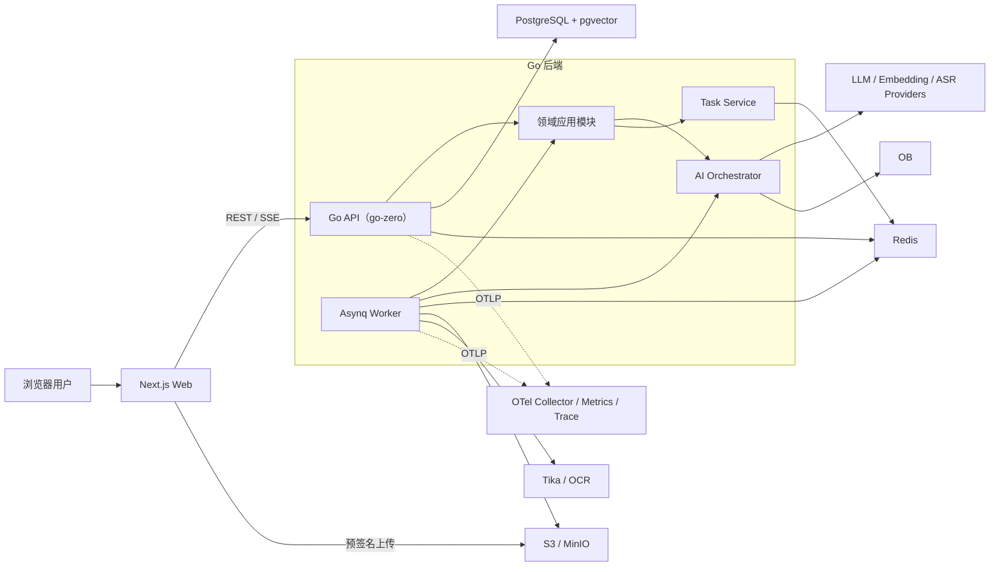
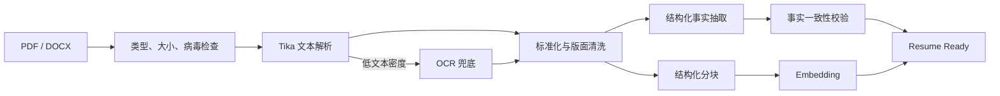

# InterviewMaster 技术方案 v1.0（正式基线）

> 更新时间：2026-07-18  
> 当前状态：历史技术基线；产品流程与模块边界已由 [`上线重构_0814.md`](上线重构_0814.md) 更新
> 适用阶段：MVP → Beta；正式规模化阶段只预留演进方向，不提前引入复杂度

## 1. 方案结论

InterviewMaster 定位为面向求职者的 AI 面试训练产品，形成以下完整闭环：

1. 上传并分析简历；
2. 绑定目标岗位、JD 和目标公司；
3. 生成带证据的个性化预测题；
4. 进行文字模拟面试；
5. 输出逐题评分、改进建议、参考回答和训练计划；
6. Beta 阶段再接入面经情报、语音转写和语音模拟。

本项目确定的技术基线如下：

| 决策项 | 确定方案 | 结论 |
| --- | --- | --- |
| 代码仓库 | 前后端 Monorepo | 统一契约、版本和 CI |
| 初始架构 | 模块化单体 API + 独立异步 Worker | 不在 MVP 拆 7 个微服务 |
| 后端 | Go 1.26.x + go-zero REST | 保留未来 zRPC 拆分能力 |
| 前端 | Next.js App Router + React + TypeScript | Web 优先，适配桌面和移动浏览器 |
| 主数据库 | PostgreSQL 18.x + pgvector | 业务数据、JSON、全文索引和 MVP 向量检索统一管理 |
| 数据访问 | pgx/v5 + sqlc + Goose | PostgreSQL 原生能力、类型安全查询和版本化迁移 |
| 缓存/队列 | Redis + Asynq | 缓存、限流、异步解析和报告生成 |
| 文件存储 | S3 兼容对象存储；本地使用 MinIO | 简历、音频和导出报告不进入数据库大字段 |
| 文档解析 | Go 统一编排 + Apache Tika 解析适配器 + OCR 兜底 | 解析能力通过接口隔离，可替换为云服务 |
| AI 编排 | Go 原生应用服务 + 自研 Provider 接口 | 不让业务核心绑定单一模型或 LangChainGo |
| 实时交互 | REST + SSE；语音阶段再引入 WebSocket | 简化 MVP，同时支持流式输出和任务进度 |
| API 契约 | go-zero `.api` 为单一事实源，生成 Swagger/OpenAPI 和前端类型 | 避免前后端类型漂移 |
| 部署 | Docker Compose 起步，生产为 Web/API/Worker 三类容器 | 规模达到拆分阈值后再使用 Kubernetes |

### 1.1 对现有方案的关键调整

- 将 `gateway/user/resume/interview/search/rag/ingestion` 七服务方案收敛为一个 API 进程和一个 Worker 进程。模块边界保留，但初期不承担 RPC、注册中心、分布式事务和多仓联调成本。
- 增加“AI 文字模拟面试”。原方案只有押题和真实面试复盘，尚未形成用户可以持续训练的闭环。
- LangChainGo 不再作为核心架构。它可以在某个 Provider 或实验功能中使用，但 Prompt、模型调用、检索、结构化输出和审计由项目自己的接口控制。
- 向量模型和维度按“Embedding Space”固定并版本化，不在同一个向量索引中随意混用不同维度。
- 将“所有生成 5～10 秒完成”调整为分层时延目标：普通 API、流式首包、短生成和深度报告分别设定指标。
- 补齐前端架构、AI 评测、Prompt Injection 防护、模型成本治理、外部面经内容合规和用户数据删除能力。

### 1.2 数据库选型结论

在确认 OceanBase 不是项目硬性要求后，数据层确定为 **PostgreSQL 18.x + pgvector**。MVP 不额外部署专用向量数据库。

| 方案 | 优点 | 代价 | 结论 |
| --- | --- | --- | --- |
| PostgreSQL + pgvector | 事务、JSON、全文、向量和备份体系统一；Go 生态成熟；本地与云环境简单 | 超大公共语料的混合检索能力弱于专用引擎 | MVP 采用 |
| PostgreSQL + Qdrant | Dense/Sparse 混合检索、RRF、过滤和水平扩展更强 | 双存储、同步、备份和权限一致性成本更高 | Beta 达到拆分阈值后再引入 |
| OceanBase | 分布式关系与混合检索集成度高 | 当前产品规模用不到其主要优势，本地资源和工程复杂度更高 | 不采用 |
| PostgreSQL + OpenSearch | 全文检索与聚合能力强 | 运维最重，仍需处理双写一致性 | 当前不采用 |

具体策略：

- 用户私有简历/JD/面试内容通常只有数百到数千个 Chunk，优先使用带 `workspace_id` 过滤的 pgvector 精确检索，获得稳定的完整召回；
- 数据量上升后再为公共语料启用 HNSW 和迭代扫描，并持续用精确检索对照 Recall；
- 中文技术词和专有名词使用结构化 `keywords`、GIN/`pg_trgm` 与向量召回组合，不依赖 PostgreSQL 英文词干能力；
- Beta 公共面经达到约 100 万 Chunk、向量索引内存/延迟不可接受，或混合检索评测长期不达标时，再将公共 Knowledge 索引迁移到 Qdrant；
- PostgreSQL 始终是文档元数据、权限和任务状态的事实源；即使引入 Qdrant，也只把它作为可重建的检索索引。

## 2. 产品边界与阶段范围

### 2.1 目标用户

MVP 默认服务个人求职者。数据模型使用 `workspace_id` 作为统一隔离边界：每个个人用户自动拥有一个个人工作区，未来可以自然扩展到学校、培训机构或企业团队，不需要在每张表同时重复 `tenant_id + user_id`。

系统角色：

- 求职者：管理简历、目标岗位、题库、模拟面试和复盘报告；
- 运营管理员：处理内容来源、Prompt/模型配置、失败任务和用量异常；MVP 只做最小管理接口，不建设完整运营后台。

### 2.2 MVP 必须交付

- 邮箱或用户名注册、登录、刷新令牌、退出；
- PDF/DOCX 简历上传、解析、版本管理和状态查询；
- 简历事实提取：技能、经历、项目、职责、指标、风险点；
- 目标岗位/JD 创建与能力要求提取；
- 个性化预测题：题目、难度、考察点、回答要点、追问分支、简历证据；
- 文字模拟面试：按面试方案逐题提问，并根据上一轮回答决定追问；
- 面试报告：逐题评分、证据、问题、改进建议、参考回答和训练清单；
- Dashboard：任务状态、最近训练、薄弱项和模型额度概览；
- 用户数据导出和删除入口。

### 2.3 Beta 范围

- 公司/岗位面经检索、去重、聚类和时效衰减；
- 音频上传、ASR 转写、说话人分离和 QA 切分；
- 语音模拟面试；
- 训练计划、错题复练、能力趋势；
- 更完整的运营管理、模型路由和付费额度。

### 2.4 明确不做

- 不提供真实面试中的隐蔽实时答题或作弊辅助；
- MVP 不做视频面试、表情识别或所谓“情绪测谎”；
- MVP 不做招聘方 ATS、职位发布和候选人筛选系统；
- MVP 不训练自有大模型，先通过模型 API + RAG 验证产品价值；
- MVP 不为“微服务完整度”而拆服务。

## 3. 总体架构



### 3.1 部署单元

MVP 只有三个应用部署单元：

1. `web`：Next.js 页面与静态资源；
2. `api`：认证、同步业务 API、SSE、任务投递；
3. `worker`：简历解析、Embedding、题库生成、面试报告等耗时任务。

API 与 Worker 共享领域模块和仓储接口，但使用不同入口和资源配额。Worker 可以按队列独立横向扩容。

### 3.2 三种请求模式

| 模式 | 适用场景 | 返回方式 |
| --- | --- | --- |
| 同步 REST | 登录、CRUD、列表、读取已完成报告 | 直接返回结果 |
| 异步任务 | 简历解析、批量 Embedding、深度报告、面经摄取 | `202 + task_id`，SSE/查询进度 |
| 流式生成 | 模拟面试提问、短回答优化 | SSE Token/事件流 |

音频实时双向流在 Beta 使用 WebSocket；不让 WebSocket 成为所有普通业务的默认通信方式。

任务进度事件使用有界保留的 Redis Streams，而不是不可恢复的纯 Pub/Sub。SSE 断线时可以通过 `Last-Event-ID` 补读保留窗口内的事件；窗口外则回退到 `tasks` 表读取最终状态。

## 4. 后端架构设计

### 4.1 代码结构

```text
InterviewMaster/
├── backend/
│   ├── api/                         # go-zero .api 契约
│   ├── cmd/
│   │   ├── api/                     # HTTP/SSE 入口
│   │   └── worker/                  # Asynq Worker 入口
│   ├── internal/
│   │   ├── modules/
│   │   │   ├── identity/            # 用户、会话、工作区
│   │   │   ├── resume/              # 简历与结构化事实
│   │   │   ├── job/                 # 目标岗位与 JD
│   │   │   ├── question/            # 预测题集
│   │   │   ├── interview/           # 模拟面试与轮次状态机
│   │   │   ├── evaluation/          # 评分、报告和训练计划
│   │   │   ├── knowledge/           # 文档、分块、检索和面经
│   │   │   └── task/                # 异步任务状态
│   │   └── platform/
│   │       ├── ai/                  # 模型 Provider 与调用治理
│   │       ├── db/                  # pgx、事务、sqlc 查询和仓储实现
│   │       ├── queue/               # Asynq 适配器
│   │       ├── objectstore/         # S3/MinIO 适配器
│   │       ├── parser/              # Tika/OCR 适配器
│   │       ├── auth/                 # JWT、刷新令牌、权限
│   │       └── telemetry/            # Log、Metric、Trace
│   ├── migrations/
│   ├── prompts/                     # Prompt 模板和版本元数据
│   └── tests/
├── web/
├── deploy/
├── docs/
└── Makefile
```

生成的 Handler/Type 只负责协议转换和校验，业务规则进入模块应用服务；数据库、模型和队列都通过接口注入。这样未来拆服务时移动的是完整模块，而不是从 Handler 中重新提取业务逻辑。

### 4.2 领域模块职责

| 模块 | 核心职责 | 不负责 |
| --- | --- | --- |
| Identity | 认证会话、工作区、权限、用量身份 | 面试业务 |
| Resume | 文件版本、解析状态、简历事实 | 直接调用前端或拼 Prompt |
| Job | 目标公司、岗位、JD、能力标签 | 面经抓取 |
| Question | 题集生成、题目版本、证据关联 | 模拟会话状态 |
| Interview | 面试方案、轮次、追问、状态机 | 评分规则配置 |
| Evaluation | Rubric、逐题评估、总报告、训练计划 | 修改原始回答 |
| Knowledge | 文档、分块、Embedding、混合检索、来源 | 最终业务决策 |
| Task | 任务状态、进度、重试结果、幂等 | 代替 Asynq 消息本身 |

### 4.3 状态机

简历：

```text
UPLOADED → PARSING → EXTRACTING → EMBEDDING → READY
              └──────── 任意阶段失败 ────────→ FAILED
```

模拟面试：

```text
DRAFT → READY → IN_PROGRESS → COMPLETED → EVALUATING → REPORTED
                     └→ ABORTED                 └→ FAILED
```

状态迁移在应用服务中校验，并使用数据库条件更新避免重复请求造成越级迁移。

### 4.4 异步任务约束

Asynq 提供的是至少一次执行语义，因此所有 Handler 必须幂等：

- 业务数据库的 `tasks` 表是用户可见状态的事实源，Redis 队列不是；
- 任务使用 `task_type + resource_id + resource_version` 作为幂等键；
- 外部模型调用写入 `model_invocations`，可通过请求哈希识别重复调用；
- 数据库结果写入使用唯一约束或 compare-and-set；
- 重试采用指数退避，参数/文件损坏类错误直接进入不可重试失败；
- 队列建议为 `interactive`、`default`、`heavy`，分别限制并发和模型配额；
- Asynq 当前仍为 v0.x，必须锁定精确版本，并封装在 `Queue` 接口后面。

## 5. 前端架构设计

### 5.1 技术栈

- Next.js App Router、React、TypeScript；
- Tailwind CSS + shadcn/ui，形成项目自己的 Design Token；
- TanStack Query 管理服务端状态、缓存、重试与失效；
- React Hook Form + Zod 管理表单和前端校验；
- Zustand 仅管理模拟面试房间的临时 UI 状态，不复制服务端业务数据；
- 通过 `.api → Swagger/OpenAPI → TypeScript Client` 生成接口类型和请求客户端；
- Vitest/React Testing Library 做组件测试，Playwright 做关键流程 E2E。

### 5.2 页面与路由

```text
/(public)
  /login
  /register
/(workspace)
  /dashboard
  /resumes
  /resumes/[resumeId]
  /jobs
  /jobs/[jobId]
  /question-sets/[setId]
  /interviews/new
  /interviews/[sessionId]/room
  /interviews/[sessionId]/report
  /company-intel                 # Beta
  /settings
```

### 5.3 前端分层

```text
web/src/
├── app/                 # 路由、布局、loading/error boundary
├── features/            # resume/job/interview/report 等业务组件
├── entities/            # 稳定领域类型与展示组件
├── shared/
│   ├── api/             # 自动生成 Client + 少量封装
│   ├── ui/              # 通用 UI
│   ├── hooks/
│   └── lib/
└── styles/
```

约束：

- 页面首次数据优先在 Server Component 获取；文件上传、SSE 和面试房间使用 Client Component；
- 任务进度统一由一个 SSE 连接接收事件，断线后携带 `Last-Event-ID` 恢复；
- 报告的图表只展示服务端结构化结果，不在浏览器重复计算评分；
- 上传文件优先使用对象存储预签名 URL，完成后再调用 API 创建文件记录；
- 所有关键页面必须有 Loading、Empty、Error、Retry 和任务处理中状态。

## 6. AI 与 RAG 架构

### 6.1 模型抽象

核心业务只依赖以下项目接口：

```go
type ChatModel interface {
    Generate(ctx context.Context, req GenerateRequest) (GenerateResponse, error)
    Stream(ctx context.Context, req GenerateRequest) (EventStream, error)
}

type EmbeddingModel interface {
    Embed(ctx context.Context, texts []string) ([][]float32, error)
}

type SpeechToTextModel interface {
    Transcribe(ctx context.Context, input AudioInput) (Transcript, error)
}

type Reranker interface {
    Rerank(ctx context.Context, query string, docs []Document) ([]ScoredDocument, error)
}
```

Provider 适配器可以接 OpenAI 兼容接口、国内模型平台或本地模型。业务层按能力选择“抽取模型、生成模型、评估模型、Embedding、ASR”，不在领域代码中出现供应商 SDK 类型。

LangChainGo 可用于实验性 Loader、Splitter 或 Provider，但不直接暴露到领域模块。原因是项目真正需要的是少量可测试的工作流、强类型输出和完整审计，而不是一个不可替换的 Chain 层。

### 6.2 统一模型调用治理

每次模型调用记录：

- `provider/model/model_revision`；
- `prompt_key/prompt_version`；
- 输入、输出的内容哈希和脱敏摘要；
- Token、费用、首 Token 时间、总耗时、重试次数；
- `workspace_id/user_id/task_id/trace_id`；
- 结构化输出校验结果和引用证据 ID。

模型输出必须先进入 Go Struct 并通过 JSON Schema/业务校验。校验失败只允许一次“修复输出”重试，仍失败则明确返回失败，不把不完整 JSON 当成功结果保存。

### 6.3 简历摄取链路



分块不使用纯固定长度切割：

- 简历按基本信息、技能、工作经历、项目和教育经历分段；
- 项目名称、时间、角色等父级元数据复制到子块；
- 原文保存 `source_span/page_no`，用于报告引用和定位；
- 表格或扫描件标记解析置信度，低置信度事实不能作为确定事实生成。

### 6.4 预测题生成链路

1. 根据简历事实、JD 能力和用户选择生成面试蓝图；
2. 从私有简历空间检索相关证据；
3. Beta 可再从公司面经公共空间检索面试风格；
4. 生成题目、难度、考察点、回答要点和追问树；
5. 逐条验证题目引用的项目事实；
6. 去重并检查难度与能力覆盖率；
7. 保存不可变题集版本。

### 6.5 模拟面试链路

- 开始前生成 `InterviewBlueprint`：总轮数、能力分布、难度曲线和时间预算；
- 每轮读取蓝图、已提问题和上一轮回答，选择“追问”或“进入下一个能力点”；
- 面试过程中只给自然的面试官回应，不提前泄露完整评分；
- 每个问题和回答立即持久化，断线后可恢复；
- 到达轮数/时间上限或用户主动结束后，冻结 Transcript 并提交评估任务；
- 同一会话固定关键 Prompt 和模型版本，避免中途模型变化造成体验不一致。

### 6.6 评估与报告链路

评分不使用一个 Prompt 一步完成，而是分为：

1. `Intent`：问题意图和评分 Rubric；
2. `Evidence`：召回简历/JD/知识证据；
3. `Evaluation`：技术准确性、相关性、结构、深度、表达五维评分；
4. `Critique`：指出缺口和不可证实内容；
5. `Golden Answer`：只用可验证事实生成参考回答；
6. `Aggregation`：聚合强弱项和训练计划。

技术准确性不能只靠同一个生成模型自评。MVP 使用“规则检查 + 独立 Judge 调用 + 引用覆盖率”，后续引入人工标注评测集和领域题库基准。

### 6.7 检索策略

推荐检索流程：

```text
权限/元数据过滤
  → 语义向量 Top 30 + 全文 Top 30
  → RRF 融合
  → 可选 Reranker Top 8
  → 多样性与 Token Budget 选择 Top 4～6
  → 带 evidence_id 进入生成上下文
```

关键过滤字段如 `workspace_id/doc_type/company_norm/role_norm/published_at` 使用独立列和索引，不只放在 JSON 中。用户私有内容和公共内容使用明确的 `visibility` 字段，任何检索都必须在 SQL 层施加隔离条件。

### 6.8 防幻觉和 Prompt Injection

- 检索到的网页、简历和 Transcript 一律视为不可信数据，不视为系统指令；
- Prompt 明确分隔系统规则、任务、证据与用户输入；
- 清理 HTML、隐藏文本、脚本和常见注入语句并保留来源审计；
- 模型不能直接执行数据库、网络或系统工具；所有动作由后端白名单代码完成；
- 事实型输出必须带 `evidence_ids`，证据不足返回 `insufficient_evidence`；
- 参考回答禁止补造公司规模、QPS、金额、团队人数等简历没有的数据；
- 引用 ID 必须在服务端校验属于当前工作区和当前任务上下文。

## 7. 数据架构

### 7.1 存储分工

| 数据 | 存储位置 |
| --- | --- |
| 用户、工作区、简历元数据、面试、报告、任务 | PostgreSQL 关系表 |
| 文档分块、关键词/全文索引、向量 | PostgreSQL + pgvector |
| 简历原文件、音频、导出文件 | S3/MinIO |
| 队列、短期缓存、限流计数、SSE 临时事件 | Redis |
| 日志、指标、Trace | OpenTelemetry 后端 |

### 7.2 核心表

| 领域 | 核心表 | 说明 |
| --- | --- | --- |
| 身份 | `users`, `workspaces`, `workspace_members`, `auth_sessions` | 刷新令牌只保存哈希 |
| 简历 | `resumes`, `resume_versions`, `resume_facts` | 原文件版本与提取事实分离 |
| 岗位 | `job_targets`, `job_requirements` | 公司、岗位、JD、能力权重 |
| 知识 | `documents`, `document_chunks`, `embedding_spaces`, `chunk_embeddings` | 来源、分块、向量和证据位置 |
| 题库 | `question_sets`, `questions`, `question_evidences` | 题集发布后版本不可变 |
| 面试 | `interview_sessions`, `interview_turns`, `interview_events` | 会话恢复与状态审计 |
| 报告 | `evaluation_reports`, `evaluation_items`, `training_actions` | 结构化数据 + 渲染快照 |
| 系统 | `tasks`, `model_invocations`, `usage_ledgers` | 任务、模型调用和额度 |
| 面经 | `external_sources`, `company_documents`, `topic_clusters` | Beta 启用，保留来源和时间 |

每个用户数据主表都带 `workspace_id`。`created_by` 只记录操作者，不作为主要隔离条件。

### 7.3 向量模型版本策略

- 一个 `embedding_space` 固定 Provider、模型、维度、距离算法和 Chunk 策略；
- 一个向量索引只服务兼容维度，禁止把不同维度向量写入同一索引；
- 升级模型时创建新 Space，后台重算，完成后原子切换 Active Space；
- 旧 Space 保留短期回滚窗口后再删除；
- `document_chunks` 与 `chunk_embeddings` 分离，重算向量不重复存文本。

pgvector 默认精确近邻查询具有完整召回，适合 MVP 的小型私有知识空间。公共语料达到规模阈值后才创建 HNSW 近似索引；带工作区/公司过滤的 HNSW 查询启用 iterative scan，并用离线精确查询持续测量 Recall@K。不要仅凭查询变快就默认近似索引有效。

关键词召回使用两层策略：技术栈、公司、岗位、项目名等实体写入标准化 `keywords` 数组并建立 GIN 索引；英文长文本使用 PostgreSQL `tsvector`/GIN。中文正文不强行套用英文分词，MVP 依靠实体关键词、`pg_trgm` 和向量检索，Beta 再根据评测决定是否使用 Qdrant Sparse Vector。

### 7.4 数据一致性

- 业务记录与任务投递采用本地事务 + Outbox/补偿扫描，避免“数据库成功但任务未入队”；
- 所有创建类 API 支持 `Idempotency-Key`；
- 报告绑定不可变的 `resume_version_id/job_version/model/prompt`；
- 对外展示只读取 `READY/REPORTED` 版本，生成中的草稿单独保存；
- 删除用户数据时先撤销访问，再异步删除对象、分块、向量和模型调用正文，保留不含 PII 的财务/安全审计最小记录。

## 8. API 设计

统一前缀 `/api/v1`，统一错误格式至少包含：`code`、`message`、`request_id`、`details`。列表使用游标分页。

### 8.1 核心 API

```text
POST   /auth/register
POST   /auth/login
POST   /auth/refresh
POST   /auth/logout

POST   /uploads/presign

POST   /resumes
GET    /resumes
GET    /resumes/{resume_id}
POST   /resumes/{resume_id}/versions
POST   /resumes/{resume_id}/analyze

POST   /jobs
GET    /jobs/{job_id}
POST   /jobs/{job_id}/analyze

POST   /question-sets
GET    /question-sets/{set_id}

POST   /interviews
GET    /interviews/{session_id}
POST   /interviews/{session_id}/start
POST   /interviews/{session_id}/turns
POST   /interviews/{session_id}/finish
GET    /interviews/{session_id}/report

GET    /tasks/{task_id}
GET    /events                         # SSE
```

### 8.2 事件格式

SSE 事件只通知状态变化，不作为最终数据存储：

```json
{
  "event_id": "evt_...",
  "type": "task.progress",
  "resource_type": "resume",
  "resource_id": "res_...",
  "task_id": "task_...",
  "progress": 60,
  "occurred_at": "2026-07-18T10:00:00Z"
}
```

前端收到完成事件后重新读取对应资源，避免 SSE 丢事件导致页面数据不一致。

## 9. 安全、隐私与内容合规

- 全链路 TLS；密码使用 Argon2id；访问令牌短期有效，刷新令牌轮换并存哈希；Web 登录态优先使用 `Secure + HttpOnly + SameSite` Cookie，并校验 Origin/CSRF；
- 数据库、对象存储和备份启用静态加密，生产密钥进入 KMS/Secret Manager；
- 对象下载使用短期签名 URL；文件做 MIME 实测、扩展名校验、大小限制和病毒扫描；
- 日志默认脱敏邮箱、手机号、文件正文、Token、Prompt 证据正文；
- 所有 Repository 查询强制带 `workspace_id`，并通过跨工作区越权测试验证；
- 用户内容默认不用于训练或公共召回；任何共享必须显式授权；
- 支持删除简历、会话、音频及账户，并记录删除任务状态；
- 外部面经只通过合规搜索 API、允许抓取的来源或用户主动提供内容获取；尊重 robots、站点条款和版权；
- 公共面经优先保存结构化题目、短摘要、指纹、来源 URL 和抓取时间，不镜像发布整篇原文；
- AI 评分明确标注为训练建议，不宣称是招聘结论或绝对能力判定。

## 10. 可观测性与成本治理

### 10.1 可观测性

- 统一 JSON 日志，贯穿 `request_id/trace_id/task_id/workspace_id`；
- 使用 OpenTelemetry Trace 和 Metric，生产通过 OTLP 发送到 Collector；
- 关键指标：API P95、错误率、队列延迟、任务失败率、模型首 Token/总耗时、Token、费用、检索空结果率、结构化输出失败率；
- AI Trace 只记录脱敏摘要、哈希和元数据，正文采样需受环境配置和权限控制；
- 告警优先覆盖登录异常、跨工作区拒绝、队列堆积、模型错误激增和单用户费用异常。

### 10.2 时延目标

| 链路 | MVP 目标 |
| --- | --- |
| 普通 CRUD API | P95 < 300 ms |
| 异步任务受理 | P95 < 500 ms |
| 流式生成首事件 | P95 < 2.5 s（不含供应商大面积故障） |
| 单轮文字提问 | 典型 3～8 s |
| 简历分析/题集生成 | 30～90 s，异步 |
| 深度面试报告 | 1～3 min，异步并显示逐步进度 |

### 10.3 成本控制

- 所有模型调用设置最大输入、最大输出、超时和按用户并发限制；
- 简历分析、题集和报告按资源版本缓存，重复读取不重复生成；
- Embedding 批量调用；检索后压缩上下文；
- 使用场景路由：事实抽取可用较小模型，复杂评估使用更强模型；
- 设置工作区日/月预算软硬阈值，超过软阈值降级，超过硬阈值拒绝新生成；
- 账本按调用追加，不能只依赖模型供应商月底账单。

## 11. 测试与 AI 质量评测

### 11.1 常规工程测试

- 单元测试：状态机、权限、评分聚合、分块、幂等和成本计算；
- 仓储集成测试：使用真实 PostgreSQL + pgvector 测试事务、权限过滤、向量和全文 SQL；
- 队列测试：重复投递、Worker 崩溃、超时、重试和死信恢复；
- Contract Test：从 `.api` 生成契约，校验前端 Client 与后端响应；
- E2E：注册 → 上传简历 → 分析 → 创建岗位 → 生成题集 → 模拟 → 查看报告；
- 安全测试：水平越权、恶意文件、签名 URL 过期、Prompt Injection、日志泄密。

### 11.2 AI 评测集

建立版本化 Golden Dataset，至少覆盖：

- 不同格式和质量的中英文简历；
- Java/Go/前端/产品等不同岗位；
- 有量化指标、无量化指标、时间冲突和疑似夸大的项目；
- 技术正确、部分正确、答非所问和完全错误的模拟回答；
- 含恶意提示的简历、JD 和网页片段。

核心指标：

| 能力 | 指标 |
| --- | --- |
| 简历抽取 | 字段 Precision/Recall、事实引用准确率 |
| 检索 | Recall@K、MRR、权限过滤 100% |
| 题目生成 | 简历相关度、JD 覆盖度、重复率、难度分布 |
| 报告 | 引用覆盖率、无依据陈述率、人工评分一致性 |
| 稳定性 | JSON Schema 通过率、任务成功率、重试率 |
| 成本 | 每份简历、每次模拟、每份报告的 Token 和金额 |

Prompt 或模型升级必须跑同一评测集，低于基线不能直接上线。

## 12. 部署与开发环境

### 12.1 本地开发

Docker Compose 启动：

- PostgreSQL 18 + pgvector；
- Redis；
- MinIO；
- Apache Tika；
- 可选 OpenTelemetry Collector + Jaeger/Prometheus。

Web/API/Worker 支持本机运行和容器运行。集成测试直接使用带 pgvector 扩展的 PostgreSQL 容器，开发、CI 和生产保持相同数据库语义。

### 12.2 生产起步

```text
CDN / WAF
  → Ingress
      → Next.js Web × N
      → Go API × N
      → Go Worker × N（按队列独立并发）
  → 托管 PostgreSQL（支持 pgvector）/ Redis / 对象存储
  → OTel Collector → 指标、日志、Trace 后端
```

- API 无状态，可横向扩容；
- Worker 优雅关闭时停止领取新任务并等待当前任务或安全重试；
- 数据迁移使用向前兼容的 Expand/Contract 流程；
- 每日备份并定期做恢复演练；
- CI 至少执行格式化、静态检查、单测、构建、迁移检查、前端类型检查和 E2E 冒烟。

## 13. 微服务演进条件

不按“开发阶段”机械拆微服务，只有满足以下一种情况才拆：

- 某模块需要完全独立扩缩容且 API/Worker 进程无法满足；
- 团队出现明确独立所有权，需要独立发布节奏；
- 故障隔离有量化收益，例如外部抓取持续影响核心面试链路；
- 单体部署、构建或数据库资源竞争已经成为可测瓶颈；
- 安全或合规要求必须进行网络和数据级隔离。

优先拆分顺序建议：

1. `ingestion/search worker`：外部内容和重 IO，故障面最大；
2. `ai-gateway`：模型配额、路由与供应商隔离；
3. `interview realtime`：语音实时连接需要独立资源；
4. 其他领域只有出现明确指标后再拆。

模块之间从第一天使用应用接口和领域事件，但在同进程内调用；拆分时再将接口替换为 zRPC/消息，不提前支付网络化成本。

## 14. 建议开发里程碑

### Milestone 0：基线与契约（3～5 个工作日）

- Monorepo、Go/Web 工程、CI、Compose；
- `.api` 契约生成链路；
- PostgreSQL/pgvector 迁移、Redis、MinIO、Tika；
- 日志、错误码、Trace、配置和 Secret 规范。

### Milestone 1：简历与岗位（5～8 个工作日）

- 认证与个人工作区；
- 预签名上传、简历版本和解析任务；
- 结构化事实、分块、Embedding；
- 岗位/JD 管理与能力提取。

### Milestone 2：题集与文字模拟（7～10 个工作日）

- 检索、预测题集和证据；
- 模拟面试蓝图、轮次状态机、SSE；
- 中断恢复和基础面试房间 UI。

### Milestone 3：报告与质量门禁（7～10 个工作日）

- 多阶段评估和训练计划；
- 报告 UI、引用定位和导出；
- AI Golden Dataset、回归评测、成本和安全门禁。

### Milestone 4：Beta 能力（按优先级迭代）

- 合规面经摄取与混合检索；
- ASR/语音面试；
- 错题复练、趋势、运营和付费。

以 1 名全栈开发者估算，MVP 约 5～7 周；2 名开发者（Go 与前端各一名）并行约 3～5 周。该估算不含大规模 UI 视觉定制、模型标注数据建设和应用商店类审核。

## 15. 技术验收标准

MVP 上线前必须同时满足：

- 一条完整 E2E 主链路稳定通过；
- 所有用户数据查询经过工作区隔离测试；
- 简历事实和参考回答可以定位到原文证据；
- Worker 重复执行不会生成重复版本或重复收费；
- Prompt/模型/Embedding/Chunk 策略均可追溯；
- 用户可以删除自己的简历、会话和账户数据；
- AI 评测集达到约定基线，没有阻断级 Prompt Injection；
- 有模型超时、限额、供应商不可用时的明确失败与重试体验；
- 已测量每次核心流程的时间和费用，而不是只记录功能是否成功。

## 16. 已确认的产品决策

以下内容作为需求文档和开发计划的固定输入：

| 决策 | 确定值 | 影响 |
| --- | --- | --- |
| 首发用户 | 个人求职者 | 采用个人工作区模型 |
| MVP 是否含模拟面试 | 含文字模拟 | 构成完整训练闭环 |
| 主数据库 | PostgreSQL 18.x + pgvector | OceanBase 不是硬性要求，不采用 |
| 首发前端 | Next.js Web | 暂不做原生 App/小程序 |
| 模型接入策略 | Provider 可插拔；实施阶段用评测集选择一个主模型和一个降级模型 | 避免架构绑定单一供应商 |
| 面经功能优先级 | Beta，不进入第一版闭环 | 降低爬取合规与数据质量风险 |
| ASR 与语音面试 | Beta | MVP 先验证面试策略和报告质量 |

## 17. 选型依据

- Go 当前稳定版本与支持策略：[Go Release History](https://go.dev/doc/devel/release)
- go-zero 的 REST/RPC、代码生成与稳定性能力：[go-zero Documentation](https://go-zero.dev/)
- `.api` 单一事实源与 Swagger 生成：[API DSL Reference](https://go-zero.dev/reference/api-dsl/)、[goctl Swagger](https://go-zero.dev/reference/cli-guide/swagger/)
- PostgreSQL 18 当前稳定版本与索引能力：[PostgreSQL 18 Press Kit](https://www.postgresql.org/about/press/presskit18/en/)、[PostgreSQL Full Text Search](https://www.postgresql.org/docs/current/textsearch.html)、[pg_trgm](https://www.postgresql.org/docs/current/pgtrgm.html)
- pgvector 的精确/HNSW 检索、过滤、迭代扫描和混合检索建议：[pgvector](https://github.com/pgvector/pgvector)
- Go 的 PostgreSQL 原生驱动、连接池和类型能力：[pgx](https://github.com/jackc/pgx/)
- 如果 Beta 需要独立检索引擎，Qdrant 提供 Dense/Sparse 与 RRF 混合查询：[Qdrant Hybrid Queries](https://qdrant.tech/documentation/search/hybrid-queries/)
- Asynq 的至少一次执行、重试、优先级队列及 v0.x 稳定性说明：[Asynq](https://github.com/hibiken/asynq)
- Next.js App Router 及 TypeScript 默认工程能力：[Next.js App Router](https://nextjs.org/docs/app)、[Installation](https://nextjs.org/docs/app/getting-started/installation)
- Go 可观测性组件的稳定状态：[OpenTelemetry Go](https://opentelemetry.io/docs/languages/go/)
